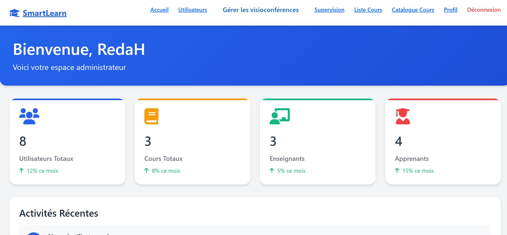
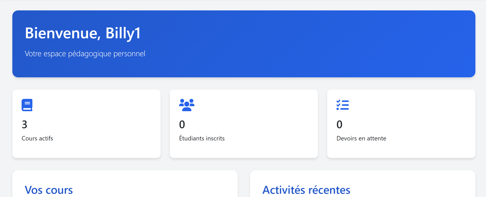
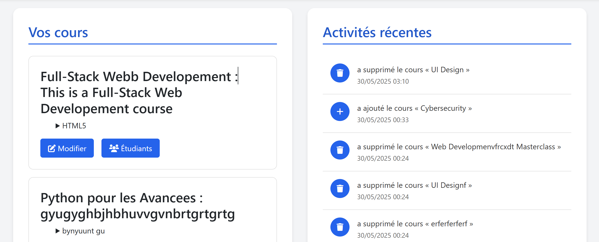
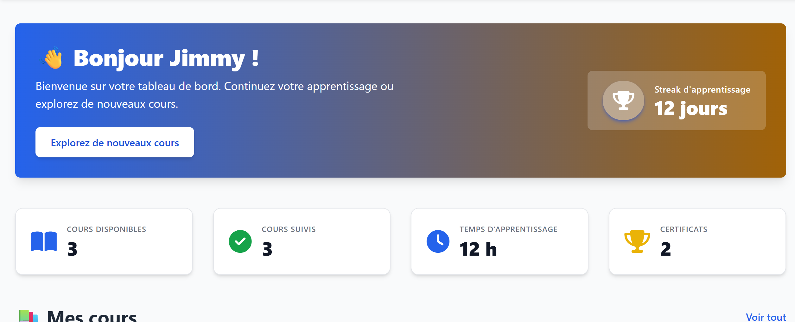

# 🎓 SmartLearn - Django E-Learning Platform


---

**SmartLearn** is a complete web-based Learning Management System (LMS) built with Django.  
It offers a user-friendly platform for administrators, instructors, and students, enabling full control over courses, users, content, and progress tracking — all through beautiful role-based dashboards.

---

## 🚀 Features

- 🔐 **Authentication & Authorization**  
  Secure login system with role-based access for Admins, Teachers, and Students.

- 📚 **Course Management**  
  Teachers can create, update, and organize courses; students can browse, enroll, and follow their learning path.

- 📊 **Role-Based Dashboards**  
  Customized dashboards for each user role with real-time data:
  - **Admin** — Manage users, courses, and monitor platform activity.
  - **Teacher** — Manage their courses, students, and monitor progress.
  - **Student** — Browse, enroll, and track their learning.

- 📄 **PDF Generation**  
  Export reports and generate certificates using ReportLab.

- 📁 **Media & Static Files Handling**  
  Organized storage for uploaded files, images, and static resources.

- 📱 **Responsive Design**  
  Clean, mobile-friendly UI using Tailwind CSS and FontAwesome.

- ⚙️ **Secure Configuration with Environment Variables**

---

## 📸 Screenshots

### Home Page


### Courses


### Admin Dashboard



### Teacher Dashboard





### Student Dashboard




---

## 🗂 Project Structure

```bash
smartlearn-main/
├── SmartLearnv1/         # Django project configuration and core settings
├── admin_app/            # Admin functionality and views
├── authentication/       # User authentication and management
├── cours/                # Course management system
├── dashboard/            # User dashboards based on roles
├── backend/              # Reserved for future backend logic
├── static/               # Static files (CSS, JavaScript, images)
├── templates/            # HTML templates
├── db.sqlite3            # SQLite database (for development)
├── manage.py             # Django management script
├── requirements.txt      # Python dependencies
└── .env                  # Environment variables configuration
````

---

## ⚙️ Installation Guide

### 1️⃣ Clone the Repository

```bash
git clone https://github.com/YOUR_USERNAME/smartlearn.git
cd smartlearn-main
```

### 2️⃣ Create and Activate Virtual Environment

```bash
python -m venv venv
# On Windows:
venv\Scripts\activate
# On Mac/Linux:
source venv/bin/activate
```

### 3️⃣ Install Dependencies

```bash
pip install -r requirements.txt
```

### 4️⃣ Configure Environment Variables

Create a `.env` file in the project root:

```env
DJANGO_SECRET_KEY=your-secret-key
DJANGO_DEBUG=True
DJANGO_ALLOWED_HOSTS=localhost,127.0.0.1

# MySQL (optional)
DB_NAME=smartlearn_db
DB_USER=your_db_user
DB_PASSWORD=your_db_password
DB_HOST=localhost
DB_PORT=3306
```

### 5️⃣ Apply Migrations

```bash
python manage.py migrate
```

### 6️⃣ Create Superuser (Optional)

```bash
python manage.py createsuperuser
```

### 7️⃣ Start Development Server

```bash
python manage.py runserver
```

### 8️⃣ Access the Application

Open [http://localhost:8000](http://localhost:8000) in your browser.

---

## 📦 Tech Stack

* 🐍 **Python 3.11**
* 🌐 **Django 4.2**
* 📄 **ReportLab (PDF Reports)**
* 💾 **SQLite / MySQL**
* 🗃 **python-dotenv**
* 🎨 **Tailwind CSS & FontAwesome**

---

## 🔐 Environment Variables Example

```env
DJANGO_SECRET_KEY=your-secret-key
DJANGO_DEBUG=True
DJANGO_ALLOWED_HOSTS=localhost,127.0.0.1
```

---

## 🤝 Contribution

Contributions are welcome!
Please fork the repository and submit pull requests.
For major changes, open an issue to discuss your proposals first.

---

## 📄 License

Licensed under the [MIT License](LICENSE).

---

## 📩 Contact

For any questions or support, open an issue on GitHub.


